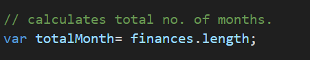
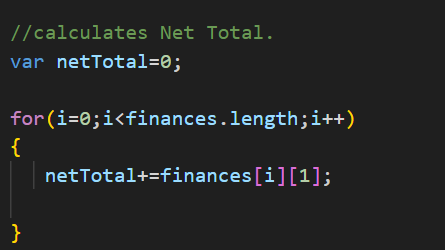
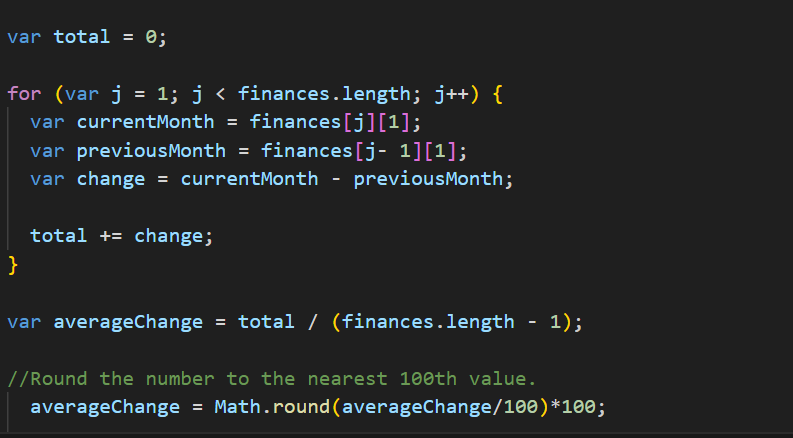
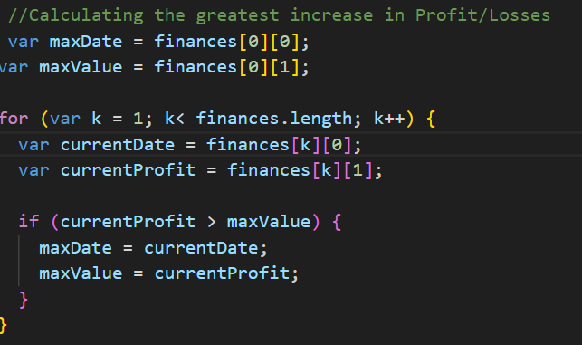
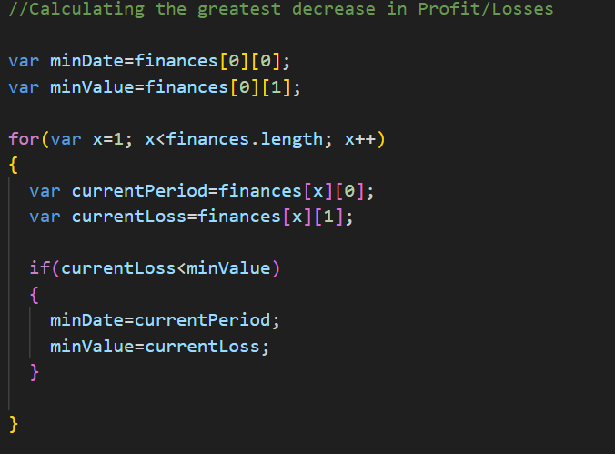
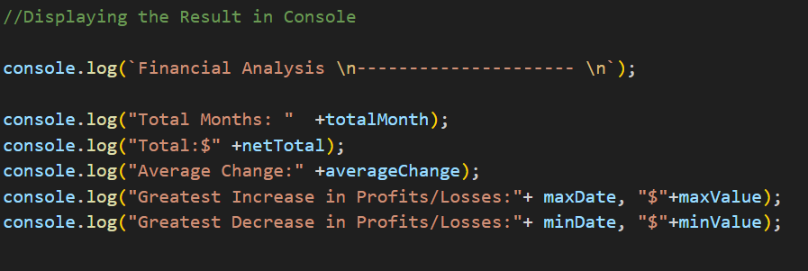
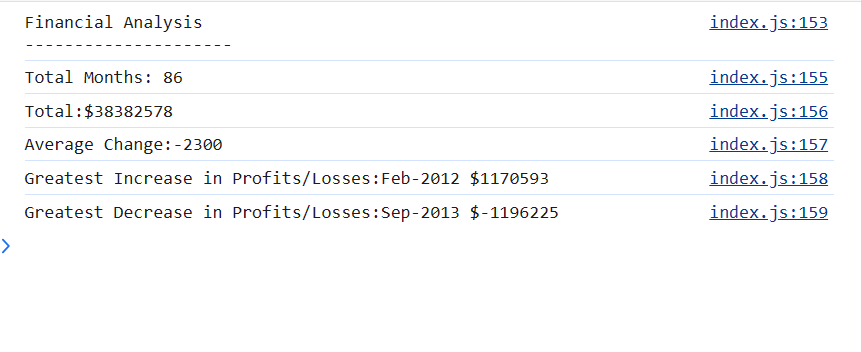

# Console-Finances
## Description:
    Console-Finances describes analyzing financial records of a company with given dataset.

## Code Description:
* Calculating Total no. of Months

  The above code calculates the total no. of months given in the data set.

* Calculating Net Total Amount

  The above code calculates net total amount of Profit/Losses over the entire period.

* Calculating Average of the changes in Profit/Losses

  The above code calculates total change in Profit/Losses from month to month and finds the average.

  Var change in the above code compares and find the differece between the current month and previous month.

  Math.round(averageChange/100)*100 rounds the Average Change Value to the nearest 100.

* Calculating greatest increase in Profit/Losses:

The above code calculates the greatest increase in Profit/Losses (date and difference in the amounts) over the entire period.

* Calculating greatest decrease in Profit/Losses:

The above code calculates the greatest decrease in Profit/Losses (date and difference in the amounts) over the entire period.

* Displaying the result in Console:

The above code displays the Result in console.
'+' operator helps to display two different data type  results together.

* Actual Result:

The above image is the actual result displayed in the console when the code is executed.

